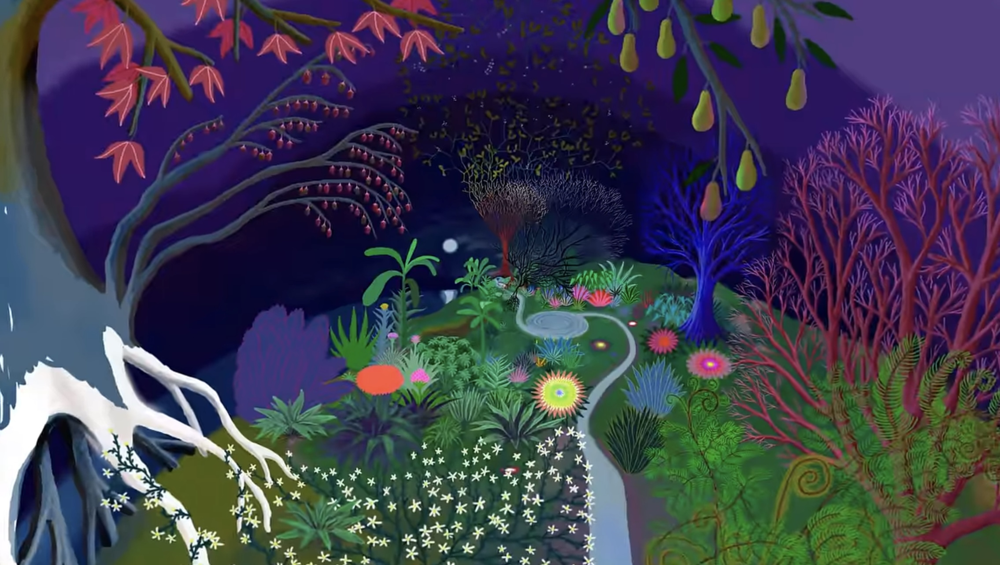
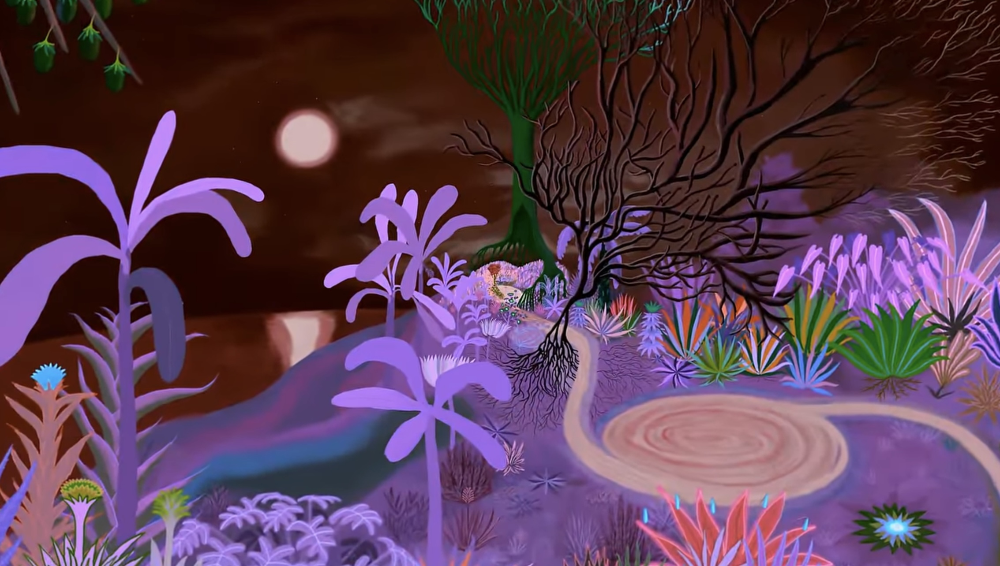

# Quiz 8

### Part 1

My project was inspired by a unique visual art video called ***Infinite Zoom Art* created by Arkadia Zoomquilt**. The video is ten hours long and shows a continuously zoomed in image that is colorful and changing colors as it zooms in. This art form appeals to me because it shows how a sense of dynamism and visual depth can be created through simple zooms and color changes.

In my project, I plan to draw on this technique to amplify the visual and emotional experience of the viewer. Inspired by this artwork, I want to return to the starting scene at the end of my project to create a complete visual loop. This loop not only demonstrates the infinite unfolding of images, but also symbolizes the continuous flow of time and perception, providing the viewer with an experience that is both immersive and reflective.

[Link to Infinite Zoom](https://www.youtube.com/watch?v=zowLNSKyfI0)
 

### Part 2

To achieve the above effect, I refer to two specific strings of code. 

[Link to first code](https://editor.p5js.org/stevengerats/sketches/aWoCFoHKo)

The first code achieves the basic animation effect by preloading and cycling through a sequence of images. The method is to gradually increase the scaling of each image while cycling through the images. This not only achieves a cyclic playback of the images, but also adds the visual effect of dynamic zooming to simulate the feeling of infinite zoom. 

[Link to second code](https://happycoding.io/tutorials/p5js/animation#the-draw-loop)

The second piece of code shows how to control the animation through simple state management, with the example showing the vertical movement of a circle. This idea can be used to adjust the speed and degree of image zoom. By setting a zoom state and updating this state at each frame, I can precisely control the zoomed-in behavior of the image. When the image is zoomed out to a certain degree, the state can be reset, resulting in a continuous loop.